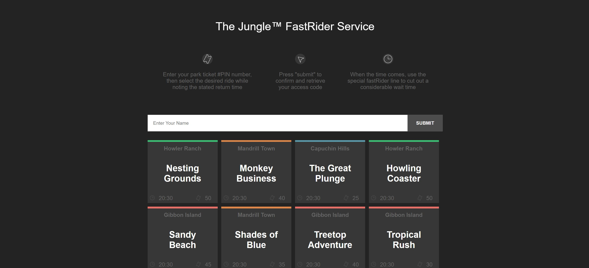
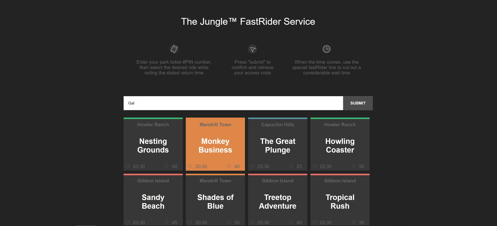
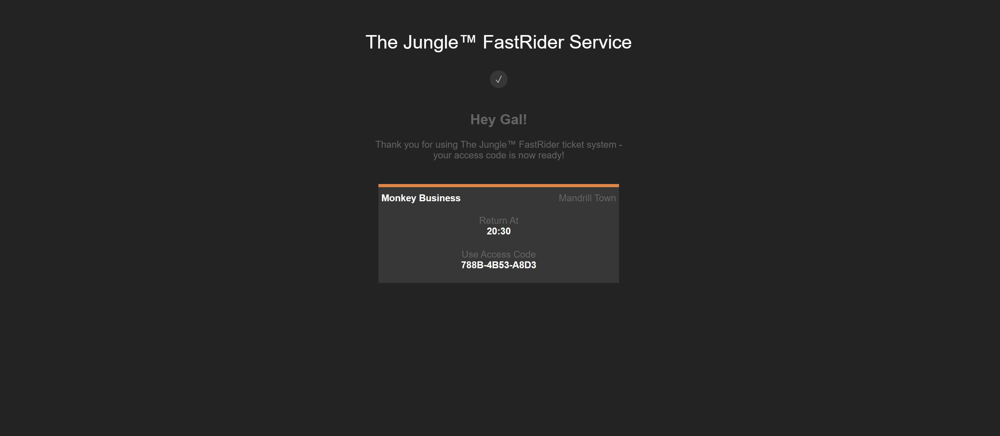

# FastRider

Front End React Website.

Amusement park website, displays all available rides, return times, and how many tickets there are left for a specific ride.
The user enters his first name and selects the desired ride.
After confirmation with get and post, we go to the "ConfirmCard" which shows the user his access code.

# Screenshots:

